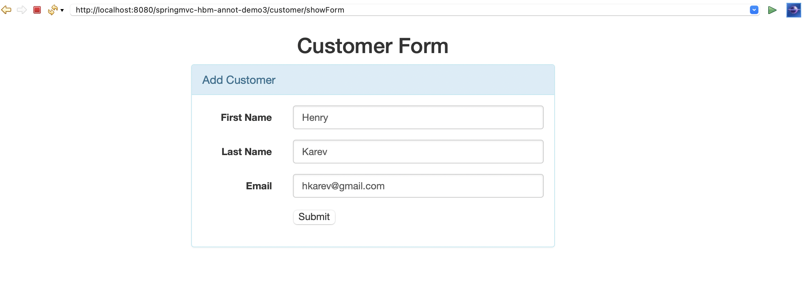

# Spring MVC + Hibernate + JSP + MySQL (Java Annotation Based Configuration)

This project creates a CRUD (Create, Read, Update, Delete) application using Spring MVC, Hibernate, JSP, and MySQL database.

### Software/technologies Used:

- Java 8
- Spring Tool Suite 4
- Hibernate 5.x
- Spring framework 5.x
- JSTL 1.2
- MySQL Database 8.x
- Maven 3.2
- Bootstrap 5.1

### Project Structure


### Class Diagram


### Configure DispatcherServlet using Java-based Spring configuration
Instead of using `web.xml`, we can use `AbstractAnnotationConfigDispatcherServletInitializer` class to register and initialize the `DispatcherServlet` programmatically as follows
```
package com.demo.config;

import org.springframework.web.servlet.support.AbstractAnnotationConfigDispatcherServletInitializer;


public class AppInitializer extends AbstractAnnotationConfigDispatcherServletInitializer {
 
	@Override
	protected Class<?>[] getRootConfigClasses() {
		return new Class[] { AppContext.class };
		//return null;
	}
 
	@Override
	protected Class<?>[] getServletConfigClasses() {
		return new Class[] { WebMvcConfig.class };
	}
 
	@Override
	protected String[] getServletMappings() {
		return new String[] { "/" };
	}
}
```

### Spring and Hibernate Integration using Java-based Spring configuration
```
package com.demo.config;

import java.util.Properties;


import javax.sql.DataSource;

import org.springframework.beans.factory.annotation.Autowired;
import org.springframework.context.annotation.Bean;
import org.springframework.context.annotation.ComponentScan;
import org.springframework.context.annotation.Configuration;
import org.springframework.context.annotation.PropertySource;
import org.springframework.core.env.Environment;
import org.springframework.jdbc.datasource.DriverManagerDataSource;
import org.springframework.orm.hibernate5.HibernateTransactionManager;
import org.springframework.orm.hibernate5.LocalSessionFactoryBean;
import org.springframework.transaction.annotation.EnableTransactionManagement;

@Configuration
@PropertySource("classpath:database.properties")
@EnableTransactionManagement
@ComponentScan(basePackages = { "com.demo" })
public class AppContext {

	@Autowired
	private Environment environment;

	@Bean
	public LocalSessionFactoryBean sessionFactory() {
		LocalSessionFactoryBean sessionFactory = new LocalSessionFactoryBean();
		sessionFactory.setDataSource(dataSource());
		sessionFactory.setPackagesToScan(new String[] { "com.demo.entity" });
		sessionFactory.setHibernateProperties(hibernateProperties());
		return sessionFactory;
	}

	@Bean
	public DataSource dataSource() {
		DriverManagerDataSource dataSource = new DriverManagerDataSource();
		dataSource.setDriverClassName(environment.getRequiredProperty("jdbc.driverClassName"));
		dataSource.setUrl(environment.getRequiredProperty("jdbc.url"));
		dataSource.setUsername(environment.getRequiredProperty("jdbc.username"));
		dataSource.setPassword(environment.getRequiredProperty("jdbc.password"));
		return dataSource;
	}

	private Properties hibernateProperties() {
		Properties properties = new Properties();
		properties.put("hibernate.dialect", environment.getRequiredProperty("hibernate.dialect"));
		properties.put("hibernate.show_sql", environment.getRequiredProperty("hibernate.show_sql"));
		properties.put("hibernate.format_sql", environment.getRequiredProperty("hibernate.format_sql"));
		properties.put("hibernate.hbm2ddl.auto", environment.getRequiredProperty("hibernate.hbm2ddl.auto"));
		return properties;
	}

	@Bean
	public HibernateTransactionManager getTransactionManager() {
		HibernateTransactionManager transactionManager = new HibernateTransactionManager();
		transactionManager.setSessionFactory(sessionFactory().getObject());
		return transactionManager;
	}
}
```

### Demo
Once an application is up and running in Tomcat server then hit this link into the browser: http://localhost:8080/springmvc-hbm-annot/customer/list

- List of Customers: 


- Add Customer Page:
