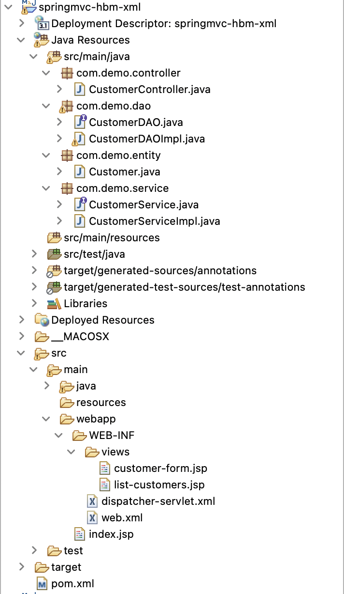
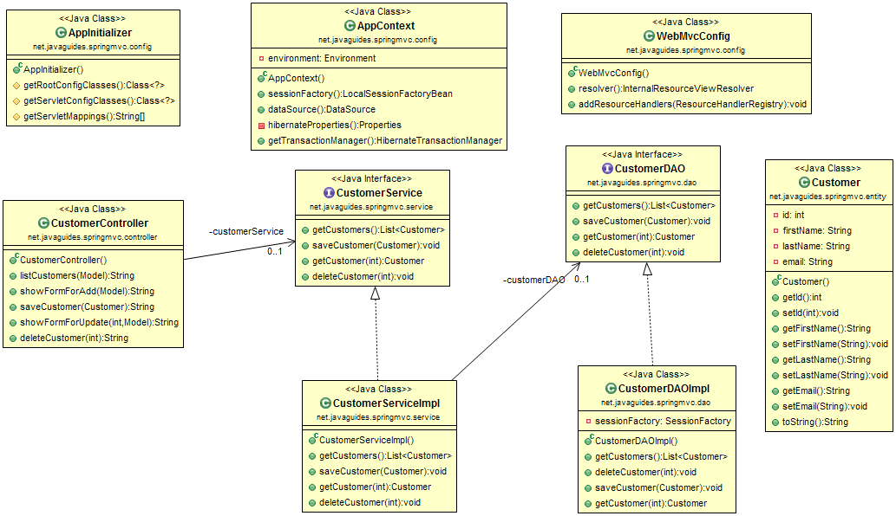
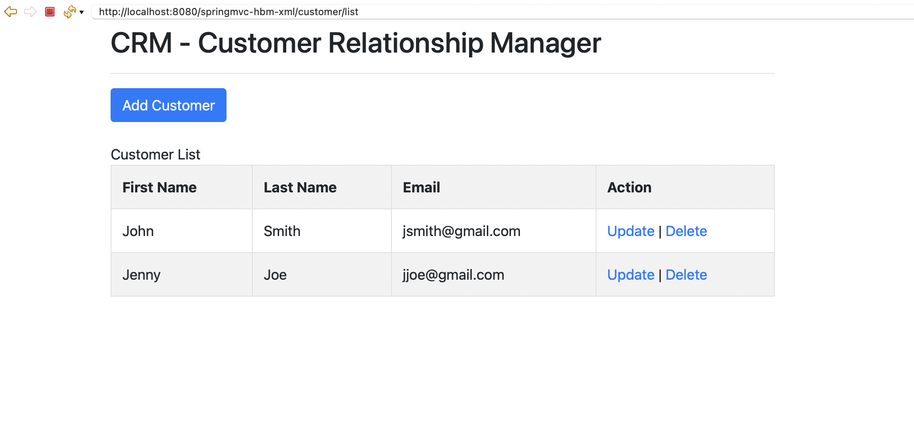
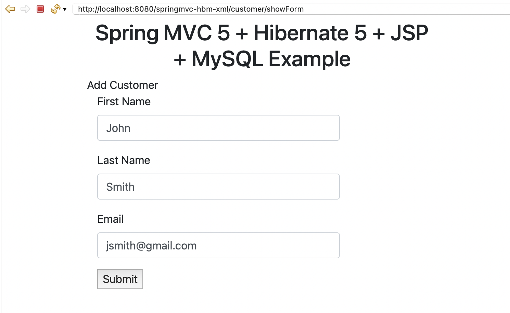

# Spring MVC + Hibernate + JSP + MySQL

This project creates a CRUD (Create, Read, Update, Delete) application using Spring MVC, Hibernate, JSP, and MySQL database.

### Software/technologies Used:

- Java 8
- Spring Tool Suite 4
- Hibernate 5.x
- Spring framework 5.x
- JSTL 1.2
- MySQL Database 8.x
- Maven 3.2
- Bootstrap 5.1

### Project Structure



### Class Diagram



### Configure DispatcherServlet using `web.xml`
```
<web-app xmlns:xsi="http://www.w3.org/2001/XMLSchema-instance"
	xmlns="http://xmlns.jcp.org/xml/ns/javaee"
	xsi:schemaLocation="http://xmlns.jcp.org/xml/ns/javaee 
http://xmlns.jcp.org/xml/ns/javaee/web-app_3_1.xsd"
	id="WebApp_ID" version="3.1">

	<display-name>Archetype Created Web Application</display-name>

	<welcome-file-list>
		<welcome-file>index.jsp</welcome-file>
	</welcome-file-list>

	<servlet>
		<servlet-name>dispatcher</servlet-name>
		<servlet-class>org.springframework.web.servlet.DispatcherServlet</servlet-class>
		<load-on-startup>1</load-on-startup>
	</servlet>

	<servlet-mapping>
		<servlet-name>dispatcher</servlet-name>
		<url-pattern>/</url-pattern>
	</servlet-mapping>

</web-app>
```

### Spring MVC Bean and Hibernate Integration using XML-based configuration

```
<?xml version="1.0" encoding="UTF-8"?>
<beans xmlns="http://www.springframework.org/schema/beans"
	xmlns:xsi="http://www.w3.org/2001/XMLSchema-instance"
	xmlns:context="http://www.springframework.org/schema/context"
	xmlns:mvc="http://www.springframework.org/schema/mvc"
	xmlns:tx="http://www.springframework.org/schema/tx"
	xsi:schemaLocation="http://www.springframework.org/schema/beans http://www.springframework.org/schema/beans/spring-beans.xsd
		http://www.springframework.org/schema/context http://www.springframework.org/schema/context/spring-context-4.3.xsd
		http://www.springframework.org/schema/mvc http://www.springframework.org/schema/mvc/spring-mvc-4.3.xsd
		http://www.springframework.org/schema/tx http://www.springframework.org/schema/tx/spring-tx-4.3.xsd">

	<context:component-scan base-package="com.demo" />
	<mvc:annotation-driven />

	<!-- Define Spring MVC view resolver -->
	<bean
		class="org.springframework.web.servlet.view.InternalResourceViewResolver">
		<property name="prefix" value="/WEB-INF/views/" />
		<property name="suffix" value=".jsp" />
	</bean>
	
	<!-- Define DB Data Source / Connection Pool -->
	<bean id="myDataSource" class="com.mchange.v2.c3p0.ComboPooledDataSource" destroy-method="close">
		<property name="driverClass" value="com.mysql.cj.jdbc.Driver" />
		<property name="jdbcUrl" value="jdbc:mysql://localhost:3306/javanov2023?serverTimezone=UTC" />
		<property name="user" value="root" />
		<property name="password" value="password" />
		
		<property name="minPoolSize" value="5"/>
		<property name="maxPoolSize" value="20"/>
		<property name="maxIdleTime" value="30000"/>
	</bean>
	
	<!-- Setup Hibernate Session Factory -->
	<bean id="sessionFactory" class="org.springframework.orm.hibernate5.LocalSessionFactoryBean">
	
		<property name="dataSource" ref="myDataSource" />
		<property name="packagesToScan" value="com.demo.entity" />
		
		<property name="hibernateProperties">
			<props>
				<prop key="hibernate.show_sql">true</prop>
				<prop key="hibernate.hbm2ddl.auto">update</prop>
			</props>
		</property>
		
	</bean>
	
	<!-- Setup Hibernate Transaction Manager -->
	<bean id="myTransactionManager" class="org.springframework.orm.hibernate5.HibernateTransactionManager">
		<property name="sessionFactory" ref="sessionFactory" />
	</bean>
	
	<tx:annotation-driven transaction-manager="myTransactionManager"/>

</beans>
```

### JPA Entity - Customer.java
```
@Entity
@Table(name = "ecomm_customers")
public class Customer {

	@Id
	@GeneratedValue(strategy = GenerationType.AUTO)
	private int id;

	@Column(name = "first_name")
	private String firstname;

	@Column(name = "last_name")
	private String lastname;

	@Column
	private String email;
```

### Demo
Once an application is up and running in Tomcat server then hit this link into the browser: http://localhost:8080/springmvc-hbm-xml/customer/list

- List of Customers: 


- Add Customer Page:

